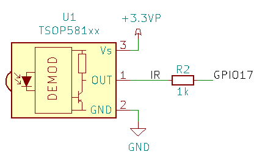

[:fr:](LISEZMOI.md) [:uk:](README.md)

# PiFanIrHat

### Ventilateur

configuration: editer le fichier /boot/config.txt, ajouter la ligne suivante

    dtoverlay=gpio-fan,gpiopin=18,temp=55000

### Bouton On/Off

Le bouton on/off button est conncté entre gpio3 et GND

configuration: editer le fichier /boot/config.txt, ajouter la ligne suivante

    dtoverlay=gpio-shutdown,gpio_pin=3,active_low=1,gpio_pull=up
    
:warning: sur le raspberry pi 4, seul l'arret fonctionne, avec le bootloader original. Pour le démarrage, le bootloader doit etre  mis à jour à la version RC3.3,
voir https://www.raspberrypi.org/forums/viewtopic.php?f=117&t=246027

### Recepteur InfraRouge

installer ir-keytable

    sudo apt install ir-keytable

configuration: editer le fichier /boot/config.txt, ajouter la ligne suivante

    dtoverlay=gpio-ir,gpio_pin=17,gpio_pull=1,rc-map-name=<keymap file for your remote>

le chemin desfichiers keymap est /lib//udev/rc_keymaps/

tester la télécommande

    sudo ir-keytable -t -v -p all

### Allumage par InfraRouge

## PCB

## Schéma

## Révision
rev1
- mauvaise empreinte pour l'eeprom
