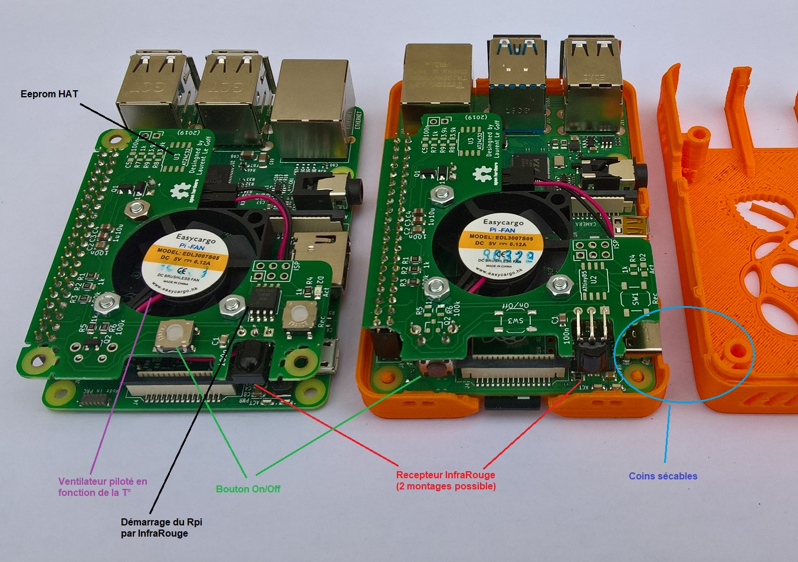
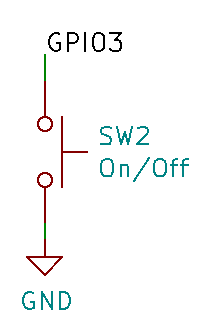

[:fr:](LISEZMOI.md) [:uk:](README.md)

# PiFanIrHat

achetez la version 1 sur [ebay](https://www.ebay.fr/itm/153597547428) :package:

achetez la version 1 (ventilateur silencieux) sur [ebay](https://www.ebay.fr/itm/153600642463) :package:

### Ventilateur

:warning: nécessite raspbian buster, la bonne version de l'overlay gpio-fan apparait avec le kernel 4.19.

configuration: editer le fichier /boot/config.txt, ajouter la ligne suivante

    dtoverlay=gpio-fan,gpiopin=18,temp=55000

### Bouton On/Off

Le bouton on/off button est conncté entre gpio3 et GND

configuration: editer le fichier /boot/config.txt, ajouter la ligne suivante

    dtoverlay=gpio-shutdown,gpio_pin=3,active_low=1,gpio_pull=up
    
:warning: sur le raspberry pi 4, seul l'arret fonctionne, avec le bootloader original. Pour le démarrage, le bootloader doit etre  mis à jour à la ~~version RC3.3~~ dernière version (voir https://www.raspberrypi.org/forums/viewtopic.php?f=117&t=246027)

La dernière version du bootloader est disponible en téléchargement,dans la section recovery https://www.raspberrypi.org/downloads/

### Recepteur InfraRouge

installer ir-keytable

    sudo apt install ir-keytable

configuration: editer le fichier /boot/config.txt, ajouter la ligne suivante

    dtoverlay=gpio-ir,gpio_pin=17,gpio_pull=1,rc-map-name=<keymap file for your remote>

le chemin desfichiers keymap est /lib//udev/rc_keymaps/

tester la télécommande

    sudo ir-keytable -t -v -p all

### Allumage par InfraRouge

:warning: sur le raspberry pi 4, seul l'arret fonctionne, avec le bootloader original. Pour le démarrage, le bootloader doit etre  mis à jour à la ~~version RC3.3~~ dernière version (voir https://www.raspberrypi.org/forums/viewtopic.php?f=117&t=246027)

La dernière version du bootloader est disponible en téléchargement,dans la section recovery https://www.raspberrypi.org/downloads/

:grey_exclamation: Pour apprendre le code InfraRouge, appuyez sur le bouton Rec, la led reste allumé, appuyez sur le bouton de la télécommande, la led s'eteind.

flash attiny85 with file [PiFanIr.hex](attiny85/PiFanIr.hex?raw=true)

    avrdude -p attiny85 -P COM5 -b 19200 -c avrisp -u -U flash:w:PiFanIr.hex

flash attiny85 fuses : lfuse:E2 , efuse:FF , hfuse:DF

    avrdude -p attiny85 -P COM5 -b 19200 -c avrisp -u -U lfuse:w:0xe2:m -U hfuse:w:0xdf:m -U efuse:w:0xff:m

## PCB

## Schéma

## Révision
rev1
- mauvaise empreinte pour l'eeprom
