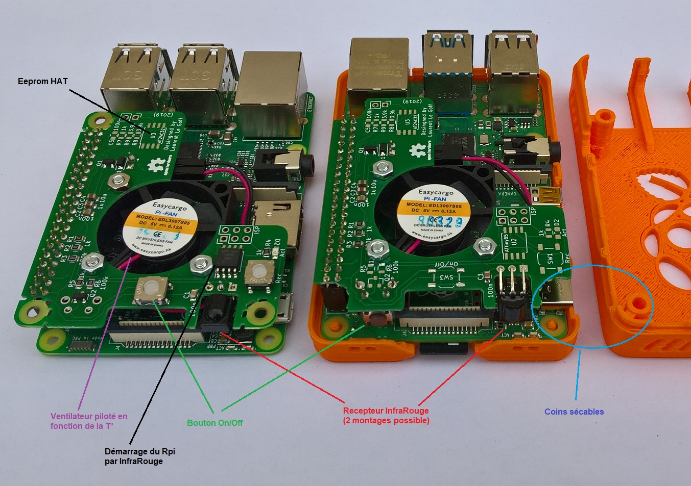
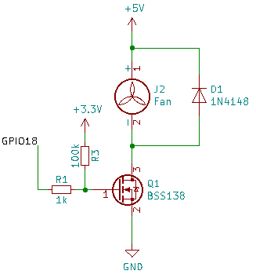
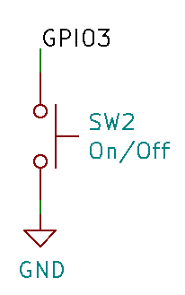
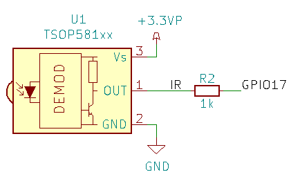
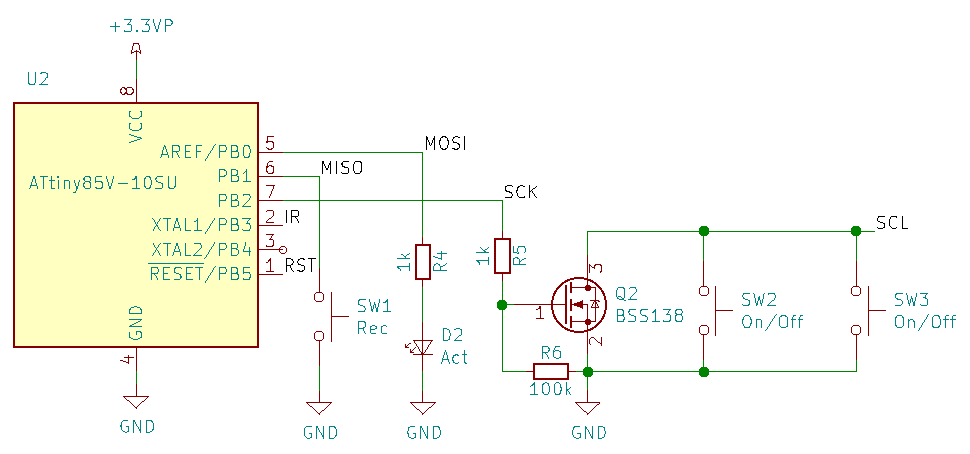
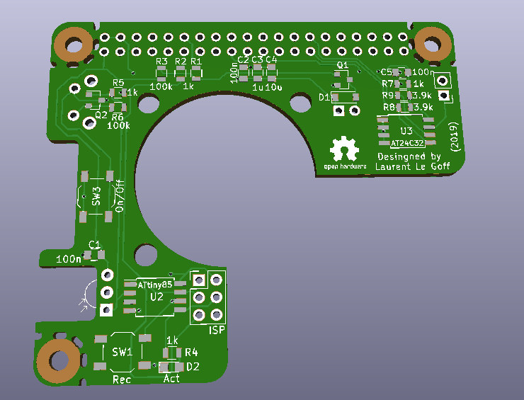
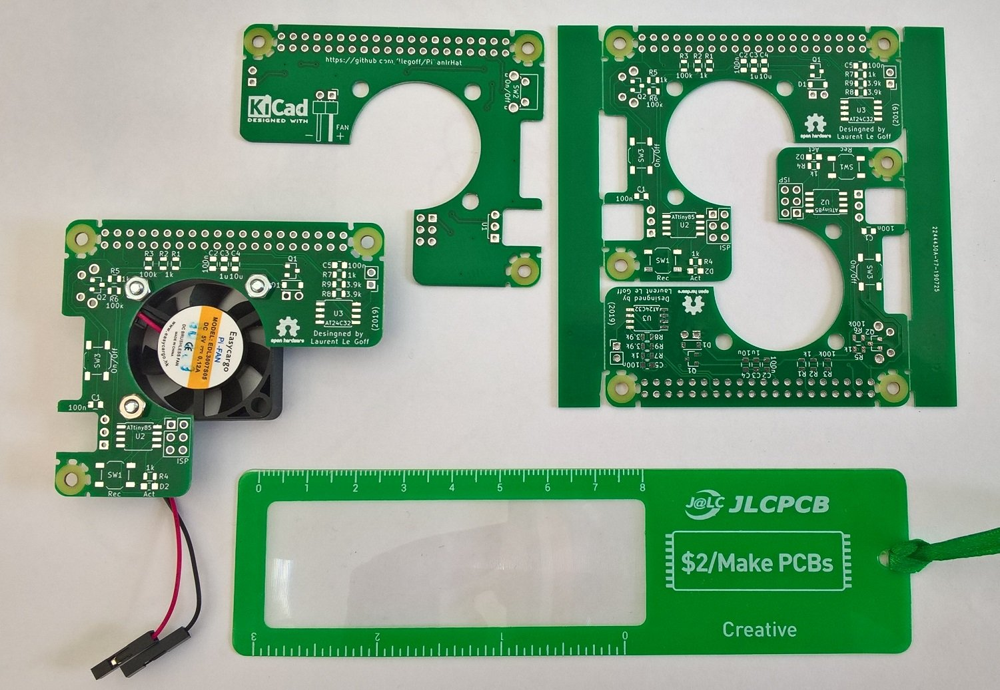
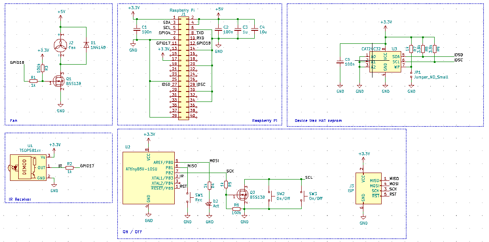

[:fr:](LISEZMOI.md) [:uk:](README.md)

buy rev1 on [ebay](https://www.ebay.fr/itm/153597547428) :package:

buy rev1 (silent fan) on [ebay](https://www.ebay.fr/itm/153600642463) :package:

# PiFanIrHat

### Fan

:warning: need raspbian buster, good version of gpio-fan overlay, come with kernel 4.19.

configuration: edit /boot/config.txt, add folowing line

    dtoverlay=gpio-fan,gpiopin=18,temp=55000

### On/Off button

on/off button is connected to gpio3 and GND

configuration: edit /boot/config.txt, add folowing line

    dtoverlay=gpio-shutdown,gpio_pin=3,active_low=1,gpio_pull=up
    
:warning: on raspberry pi 4, only shutdown work, with original bootloader. For power on, bootloader need to be update to RC3.3,
see https://www.raspberrypi.org/forums/viewtopic.php?f=117&t=246027

### IR receiver

install ir-keytable

    sudo apt install ir-keytable

configuration: edit /boot/config.txt, add folowing line

    dtoverlay=gpio-ir,gpio_pin=17,gpio_pull=1,rc-map-name=<keymap file for your remote>

keymap files path is /lib//udev/rc_keymaps/

test remote

    sudo ir-keytable -t -v -p all

### IR power On

:warning: on raspberry pi 4, only shutdown work, with original bootloader. For power on, bootloader need to be update to RC3.3,
see https://www.raspberrypi.org/forums/viewtopic.php?f=117&t=246027

flash Attiny85 with file [PiFanIr.hex](attiny85/PiFanIr.hex?raw=true)

    avrdude -p attiny85 -P COM5 -b 19200 -c avrisp -u -U flash:w:PiFanIr.hex

flash attiny85 fuses : lfuse:E2 , efuse:FF , hfuse:DF

    avrdude -p attiny85 -P COM5 -b 19200 -c avrisp -u -U lfuse:w:0xe2:m -U hfuse:w:0xdf:m -U efuse:w:0xff:m

For key learning, press Rec button, led stay on, press remote key, led rturn off.

## PCB

## Schematic

## Révision
rev1
- bad footprint for eeprom
